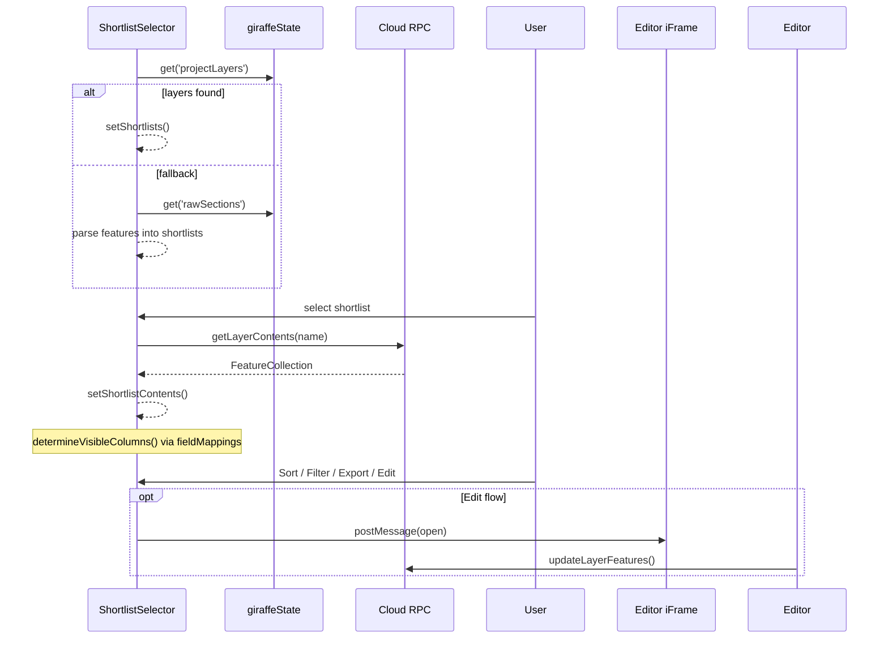

# Shortlist Module (directory: `pptxApp/Utilities/Shortlist/`)

## Purpose

Provide a **portfolio-level workspace** for creating, viewing and curating _shortlists_ of candidate sites held in the Giraffe project. A shortlist is simply a **FeatureCollection layer whose name starts with “Shortlist …”**. The module lets the analyst:

- browse all shortlist layers in the current project
- inspect each property in a sortable / filterable data grid
- add or remove lots via map drawing or CSV/Excel upload
- bulk-edit custom status fields (Long-list pass, Desktop DD, GPAC outcome…)
- export the enriched shortlist to CSV for external review or PPTX reporting

---

## Directory Map

```
Utilities/Shortlist/
├─ ShortlistSelector.jsx         (≈ 1 460 lines) – main UI, table, dashboard tabs
├─ ShortlistModifier.jsx         (≈ 1 350 lines) – add lots, file upload, duplicate checks
├─ ShortlistEditorIframe.jsx     (≈ 1 580 lines) – Ag-Grid editor loaded in bottom-bar iFrame
├─ shortlistIframe.html          – host page for the editor iFrame
├─ fieldMappings.js              – column labels, type map, value formatter (1 000+ lines)
├─ fieldTypes.js                 – enum of field types & helpers
├─ SiteSuitabilityAnalysis.js    – per-lot suitability score (re-used from Triage)
└─ exportShortlistCSV.js         – utility to download FeatureCollection ➜ CSV
```

---

## Core Components & Responsibilities

| Component                   | Responsibility                                                                                                                                                                                                                                                               |
| --------------------------- | ---------------------------------------------------------------------------------------------------------------------------------------------------------------------------------------------------------------------------------------------------------------------------- |
| **ShortlistSelector**       | Entry point (toolbar button). Fetches shortlist layers via `giraffeState.get('projectLayers')` or fallback to `rawSections`. Renders a Tailwind table where each column header is sortable (`handleSort`). Provides tabs: **Dashboard** (metrics cards), **Table**, **Map**. |
| **ShortlistModifier**       | Embeds inside `ShortlistSelector`. Adds parcels from Site-Boundary drawings, or imports a CSV/Excel to _add / update_ properties. Detects duplicates (`duplicateFeatures` Set) and colour-codes them.                                                                        |
| **ShortlistEditorIframe**   | Full-screen editor displayed in a bottom-bar iFrame when the _Edit_ button is pressed. Uses Ag-Grid for column grouping, inline editing and advanced filtering. Persists changes back to the layer via `rpc.invoke('updateLayerFeatures', …)`.                               |
| **SiteSuitabilityAnalysis** | Calculates per-lot KPIs (area, FSR, HoB, zone) and flags issues; results surface as colour pills in the table.                                                                                                                                                               |

---

## Runtime Workflow



---

## Data Model

Each shortlist **feature** contains a very wide set of attributes coming from Site-Suitability, Livability, Climate, etc. Field names follow the convention `<namespace>__<field>`, e.g. `site_suitability__area`.

`fieldMappings.js` provides:

```ts
export const defaultVisibleColumns: string[]; // initial view
export const defaultStatusFields: string[]; // yes/no progress flags
export const fieldNameMapping: Record<string, string>; // raw ➜ label
export const fieldTypeMapping: Record<
  string,
  "string" | "integer" | "float" | "zone" | "array_value"
>;
```

These mappings are _user-extendable_: new columns added in **ShortlistEditorIframe** are saved back to the layer and cached in Supabase `user_preferences` (key `shortlist.visibleColumns`).

---

## Key Interactions

- **Duplicate detection** – when adding drawing features the modifier checks `site_suitability__property_id` and `site__address` against existing shortlist features.
- **CSV / Excel import** – uploaded file is parsed with `xlsx`; users map a _match field_ (`site__address` by default) and optional _update field_ to bulk-update status flags or KPIs.
- **Dashboard metrics** – `defaultStatusFields` are aggregated to render donuts / bar charts (via Recharts) showing pass / fail counts.
- **Export** – `exportShortlistCSV(shortlistContents, fileName)` flattens geometry props to WKT and downloads a comma-separated file.

---

## Integration Points

- **Triage Selector** – re-uses `exportShortlistCSV` to pass a shortlist into the Triage mass-update flow.
- **Site-Reviewer module** – fields marked _*status*_ feed into radar chart scoring.
- **PPTX Generator** – `Shortlist → Portfolio Overview` slide consumes the exported CSV.

---

## User-Configurable Elements (see _14-user-config.md_)

- **Visible Columns** – stored under `UserMapConfig.defaultLayers` ➜ `shortlist.visibleColumns`.
- **Status Field List** – future **ShortlistConfig** (to be added) will let admins define custom yes/no fields and their colour palette.

---

## File Sizes

ShortlistSelector ~145 KB, Modifier ~122 KB, Editor ~140 KB, fieldMappings ~95 KB.

Keep this document in sync with code changes – especially when new status fields or column mappings are introduced.
